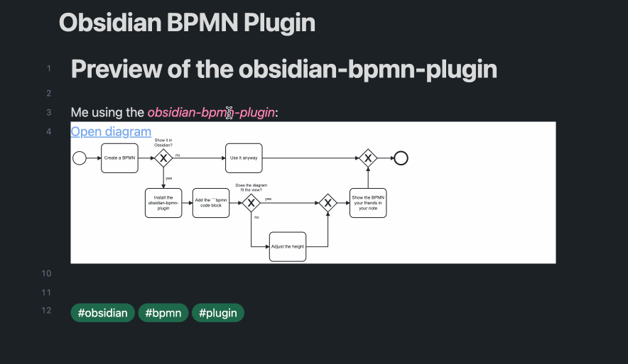

# Obsidian-BPMN-Plugin [](https://github.com/joleaf/obsidian-bpmn-plugin/releases) [](https://github.com/joleaf/obsidian-bpmn-plugin/actions/workflows/release.yml) 

This plugin lets you view BPMN models interactively in [Obsidian](https://www.obsidian.md).
Based on the [bpmn-js](https://github.com/bpmn-io/bpmn-js) library.

## How to install

1. Go to **Community Plugins** in your [Obsidian](https://www.obsidian.md) Settings and **disable** Safe Mode
2. Click on **Browse** and search for "Obsidian BPMN Plugin"
3. Click install
4. Toggle the plugin on in the **Community Plugins** tab

## How to use

1. Add a valid `*.bpmn` file to your vault (e.g., `my-diagram.bpmn`) (e.g., modeled with
   the [Camunda Modeler](https://camunda.com/de/download/modeler/))
2. Add the BPMN diagram to your note:

````
```bpmn
{
  "url": "[[my-diagram.bpmn]]"
}
```
````

### Parameter

| Parameter   | Description                                    | Values                                                    |
|-------------|------------------------------------------------|-----------------------------------------------------------|
| url         | The url of the *.bpmn file.                    | Relative/Absolute path, or "[[*.bpmn]]" as markdown link. |
| height      | The height of the rendered canvas.             | [200..1000]                                               |
| opendiagram | Show a link to the *.bpmn file.                | true/false                                                |
| zoom        | Set the zoom level. Default is 'fit-viewport'. | 0.0 - 10.0                                                |
| x           | Set the x coordinate, if a zoom value is set.  | 0 - ... (default: 0)                                      |
| y           | Set the y coordinate, if a zoom value is set.  | 0 - ... (default: 0)                                      |

### Example



## How to dev

1. Clone this repo into the plugin folder of a (non-productive) vault (`.obsidian/plugins/`)
2. `npm i`
3. `npm run dev`
4. Toggle the plugin on in the **Community Plugins** tab

## Donate

<a href='https://ko-fi.com/joleaf' target='_blank'>
