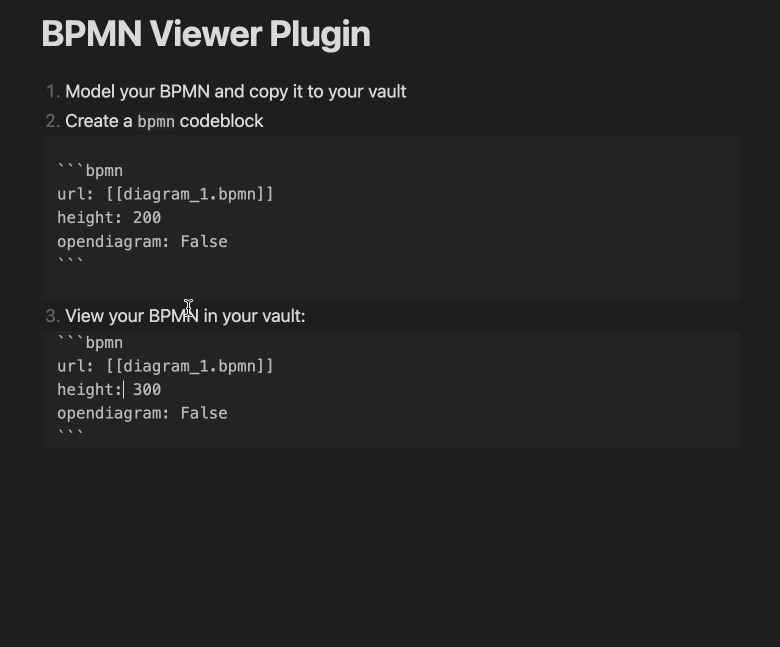

# BPMN-Plugin for Obsidian [](https://github.com/joleaf/obsidian-bpmn-plugin/releases) [](https://github.com/joleaf/obsidian-bpmn-plugin/actions/workflows/release.yml) [](https://obsidian.md/plugins?id=bpmn-plugin)

This plugin lets you view BPMN diagrams interactively in your [Obsidian](https://www.obsidian.md) notes.
The viewer is based on the [bpmn-js](https://github.com/bpmn-io/bpmn-js) library.
Furthermore, basic editing functions for BPMNs are available as well.

## Install ..

### .. automatically in Obsidian

1. Go to **Community Plugins** in your Obsidian Settings and **disable** Safe Mode
2. Click on **Browse** and search for "[BPMN Plugin](obsidian://show-plugin?id=bpmn-plugin)"
3. Click install
4. Toggle the plugin on in the **Community Plugins** tab

### .. manually from this repo

1. Download the latest [release](https://github.com/joleaf/obsidian-bpmn-plugin/releases) `*.zip` file.
2. Unpack the zip in the `.obsidan/plugins` folder of your obsidian vault

## How to use (CodeBlock)

1. Add a valid `*.bpmn` file to your vault
    1. E.g. modeled with the [Camunda Modeler](https://camunda.com/de/download/modeler/)
    2. Create a new BPMN file with the ribbon action icon
2. Add the BPMN diagram to your note:

````
```bpmn
url: [[my-diagram.bpmn]]
```
````

### Parameter

You can customize the view with the following parameters:

| Parameter            | Description                                    | Values                                                    |
|----------------------|------------------------------------------------|-----------------------------------------------------------|
| url                  | The url of the *.bpmn file (required).         | Relative/Absolute path, or "[[*.bpmn]]" as markdown link. |
| height               | The height of the rendered canvas.             | [200..1000]                                               |
| opendiagram          | Show a link to the *.bpmn file.                | True/False                                                |
| showzoom             | Show the zoom buttons below the canvas.        | True/False                                                |
| enablepanzoom        | Enable pan and zoom in the codeblock view.     | True/False                                                |
| zoom                 | Set the zoom level. Default is 'fit-viewport'. | 0.0 - 10.0                                                |
| x                    | Set the x coordinate, if a zoom value is set.  | 0 - ... (default: 0)                                      |
| y                    | Set the y coordinate, if a zoom value is set.  | 0 - ... (default: 0)                                      |
| forcewhitebackground | Force a white background.                      | True/False                                                |

### Example



## How to use (Open BPMN File)

Just open the BPMN file in your obsidian vault and the BPMN will be editable in fullscreen mode.

### Features
- Update properties
- Export SVG

## How to dev

1. Clone this repo into the plugin folder of a (non-productive) vault (`.obsidian/plugins/`)
2. `npm i`
3. `npm run dev`
4. Toggle the plugin on in the **Community Plugins** tab

## Donate

<a href='https://ko-fi.com/joleaf' target='_blank'>
